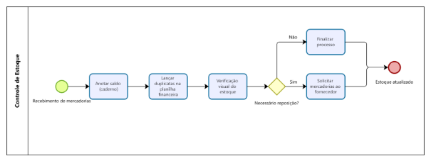
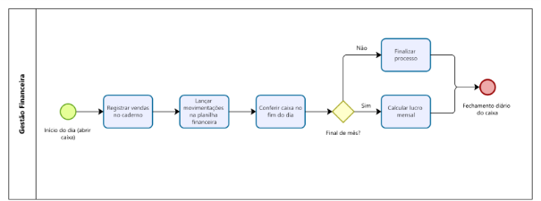

# 1.1. INTRODUÇÃO 

O presente projeto tem como objetivo analisar e propor soluções tecnológicas para a gestão de informação no petshop ANAGRO PETS LTDA, localizado em Contagem - MG. O estudo visa compreender os desafios enfrentados na administração do negócio e avaliar oportunidades de melhoria por meio da implementação de um sistema de informação adequado. 

Além de buscar contribuir diretamente para a organização estudada, o projeto também tem um papel fundamental no desenvolvimento acadêmico e profissional dos participantes. Através desse estudo, será possível aprimorar habilidades como levantamento de requisitos, análise de processos, identificação de problemas organizacionais e desenvolvimento de soluções tecnológicas viáveis. 

## Justificativa da escolha 

O AGROPET foi escolhido para este estudo pois se trata de um pequeno empreendimento do setor pet, que enfrenta desafios comuns a empresas do mesmo porte, como controle financeiro e organização de processos. A proprietária demonstrou interesse em participar do projeto e compartilhar informações para viabilizar a pesquisa. 

 
## Objetivos 

* Mapear os processos internos da empresa e sua gestão atual, identificando os fluxos de trabalho e a forma como os dados são coletados e utilizados. 

* Identificar os desafios enfrentados na gestão do petshop, especialmente no que se refere ao controle financeiro e ao armazenamento de informações sobre clientes e serviços prestados. 

* Analisar a viabilidade da implementação de um sistema de informação que possa otimizar a gestão do negócio, melhorando o controle das vendas, do estoque e das finanças. 

* Propor soluções tecnológicas acessíveis, considerando o porte da empresa e suas necessidades específicas. 
 

# 1.2. ORGANIZAÇÃO DO PROJETO 

O AGROPET é um pequeno petshop que recentemente passou por uma transição de propriedade, sendo vendido do filho para a mãe. Atualmente, a gestão enfrenta desafios, principalmente na organização financeira, pois a administração do caixa ainda é feita manualmente por meio de planilhas e cadernos. 

A equipe do petshop é composta pela proprietária e um funcionário, sendo que a dona se dedica mais à parte financeira e à reposição de produtos, enquanto o funcionário cuida do atendimento ao cliente e da organização da loja.  

Além disso, contam com uma veterinária terceirizada para a venda de medicamentos, o que garante que possam oferecer vacinas aos clientes. No futuro, a empresa planeja expandir seus serviços, incluindo banho e tosa, para atender melhor seus clientes e aumentar sua receita.

Dados sobre a organização escolhida: 

* Nome Fantasia: ANAGRO PETS 

* Endereço: Praça Nossa Sra. de Fátima, 102 - Jardim Industrial, Contagem - MG, 32220-610 

* Responsável: Ana Paula 

* Contato: (31) 98611-8523

# 1.3. ANÁLISE DE MERCADO 

O Brasil destaca-se como o 3º maior país em quantidade de pets e em faturamento, ficando atrás de Estados Unidos e China. O mercado pet brasileiro é considerado promissor e está em crescimento, com faturamento estimado em 77 bilhões em 2024 um aumento de 12% em relação a 2023. 

Em estudo do Núcleo de Inteligência e Conhecimento do Sebrae/PR em 2023 o “setor contabilizou 38.774 novos CNPJs habilitados para atividades veterinárias, comercio varejista de animais, medicamentos veterinários, pet food e acessórios, e serviços de hospedagem e embelezamento”. 

De acordo com dados da Abinpet e do IBGE os animais de estimação, estão presentes em 1,8 residências, e em 2023 estima-se uma população de 160 milhões de pets no Brasil, sendo 62 milhões de cães, 42 milhões de Aves, 30 milhões de gatos, 22 milhões de Peixes ornamentais e 2,8 milhões Pequenos répteis e pequenos mamíferos. 

Diversos fatores como o estilo de vida solitário nas grandes cidades, pandemia de Covid-19, alterações nos perfis das famílias, a verticalização de centros urbanos dentre outros tem incentivado na adoção de pets para companhia, tratamentos terapêuticos, dentre outros. 

Dessa forma os pets têm vivido cada vez mais dentro de casa e incentivam o investimento em alimentação e cuidados com saúde, e assim pode-se observar o aumento no faturamento do mercado pet nos últimos anos. 

  
Gráfico 1 – Faturamento Mercado Pet no Brasil em R$ bilhões

  
  
Fonte: (Adaptado de Revista Cães&Gatos apud Abinpet e Inst. Pet Brasil, 2024)

O mercado pet encontra-se dividido em segmentos, conforme descrito no quadro abaixo, no 3º trimestre de 2024, o segmento de Pet Food(alimentação) liderou o setor com 55% do faturamento, no entanto em comparação com o mesmo período em 2023 observa-se que os Segmentos Pet Vet(produtos veterinários) e de Serviços veterinários tiveram aumento de mais de 15%, o que pode indicar oportunidade de mercado e aumento nos cuidados com a saúde dos pets. 

Quadro 1 – Faturamento Mercado Pet no Brasil no 3º trimestre 2024 por segmento 
|Segmento                         | Faturamento em bilhões R$         | %     |    Variação   2023 x 2024    |
|---------------------------------|-----------------------------------|-------|------------------------------|
|Pet Food (Alimentos)             |  R$ 42,63                         | 55,1% |   11,8%                      |
|Vendas T. de animais             |  R$ 8,14                          | 10,5% |  12,1%                       |
|Pet Vet (produtos veterinários)  |  R$ 8,01                          | 10,4% |  16,2%                       |
|Serviços Veterinários            |  R$ 7,63                          | 9,9%  |  15,4%                       |
|Serviços Gerais                  |  R$ 6,50                          | 8,3%  |  10,1%                       |
|Pet Care (higiene e bem estar)   |  R$ 4,45                          | 5,8%  |  13,3%                       |
|Total                            |  R$ 77,36                         | 100%  |  12,6%                       |

Em 2024, as Pequenas e Médias empresas representam a maioria do faturamento com 37,7 bilhões, Clínicas e Hospital Veterinários 13,9 bilhões e Pet Shop Mega Store com 7,3 bilhões de faturamento. 

 

  
Gráfico 2 – Canais de acesso a produtos e serviços por faturamento em R$ bilhões no 3º trimestre de 2024

  
  
Fonte: Fonte: (Adaptado de Revista Cães&Gatos apud Abinpet e Inst. Pet Brasil, 2024)

Apesar no crescimento no faturamento e novas empresas no mercado pet, dados da Abinpet indicam que o setor encontra desafios com a alta carga de impostos para pagar, sendo o segmento Pet Food o mais impactado com cerca de 50% de tributos, sendo a média mundial por volta de 18%. 

 

## 1.3.1 Análise SWOT 

A análise SWOT também conhecida como análise FOFA em português, é uma ferramenta de gestão que possibilita uma visão ampla e estratégica sobre negócios e/ou projetos, auxilia na identificação de pontos fortes e fracos, oportunidades e ameaças, permitindo uma melhor compreensão e planejamento para tomada de decisão. Para auxiliar no desenvolvimento de sistema para a empresa Agropet, foi elaborada a análise abaixo: 

Quadro 2 - Análise SWOT para a empresa Agropet

| Ambiente Interno                                                                                                                                   | Ambiente Externo                                                                                              |
|--------------------------------------------------------------------------------------------------------------------------------------------------------|--------------------------------------------------------------------------------------------------------------------|
| **FORÇAS** são destaques e diferenciais frente aos concorrentes:   - Prestação de serviços veterinários através da terceirizada   - Variedade na oferta de produtos/mercadorias   - Localização na cidade de Contagem (um dos maiores pólos logísticos de Minas Gerais) | **OPORTUNIDADES:** são espaços para melhorar e crescer no mercado.    - Mercado em crescimento, em especial nos segmentos de alimentação e produtos veterinários   - Relação de afeto entre tutores e pets   - 1,8 pet por residência brasileira, com predominância de cães |
| **FRAQUEZAS:** são pontos que ainda podem ser melhorados.    - Elaboração de processos   - Gestão do negócio   - Sistemas de Informação | **AMEAÇAS:** são fatores de risco, obstáculos e desafios que podem atrapalhar os planos.    - Alta carga de impostos para pagar   - Legislação em constante atualização   - Concorrência |

Fonte: Autores, 2025

1.4. ANÁLISE DE PROCESSOS E SISTEMAS 

a - Vendas e Atendimento ao Cliente 

As vendas são registradas manualmente em um caderno, sem a emissão de comprovantes formais, exceto nos casos de pagamento via cartão ou Pix, em que o comprovante da maquininha é entregue ao cliente. Não há um controle estruturado do histórico de compras de clientes e pets, sendo que todas as informações são trocadas informalmente pelo WhatsApp. A falta de um sistema de registro impacta o acompanhamento de clientes e dificulta o planejamento de ações de marketing ou promoções direcionadas.

  

b - Controle de Estoque 

O controle de entrada de mercadorias é feito manualmente em cadernos, com o saldo inicial registrado na chegada dos produtos. A saída não é controlada em tempo real, sendo a reposição realizada apenas quando a proprietária identifica visualmente que o estoque está baixo.

  

c - Gestão Financeira 

O fluxo de caixa é atualizado manualmente no início de cada dia e registrado em um caderno. O controle financeiro usa uma planilha simples, armazenada no computador da empresa, sem medidas específicas de segurança. O lucro é avaliado mensalmente, mas sem uma análise detalhada de despesas fixas e variáveis. 

  

d - Serviços Oferecidos (Vacinação) 

Não há um sistema de agendamento para serviço de vacinação oferecido ou controle de histórico de vacinação. Toda a comunicação é feita pelo WhatsApp. 

e - Cadastro de Clientes e Pets 

Atualmente, não há um cadastro formal. As informações estão fragmentadas em conversas de WhatsApp. 

f - Processos Administrativos 

As decisões administrativas são tomadas de forma intuitiva, sem base em relatórios ou métricas estruturadas. O planejamento financeiro se limita ao controle de contas a pagar. 

Os processos analisados no petshop AGROPET evidenciam a necessidade de maior estruturação e automação para garantir eficiência e melhor gestão operacional. Atualmente, diversas atividades são realizadas manualmente, como o registro de vendas, controle de estoque e acompanhamento financeiro, o que pode gerar erros e retrabalho. A ausência de um cadastro formal de clientes e pets dificulta a comunicação estratégica com os clientes e o planejamento de ações comerciais. Além disso, o controle de agendamentos e serviços veterinários ainda é informal, sendo realizado via WhatsApp sem um histórico estruturado. 

Diante desse cenário, as principais oportunidades de melhoria incluem a implementação de um sistema integrado de gestão, que possibilite o registro automatizado de vendas, controle de estoque em tempo real e gerenciamento financeiro estruturado. A criação de um banco de dados de clientes e pets permitirá um melhor acompanhamento do histórico de serviços e compras, possibilitando ações personalizadas. Além disso, a automação de alertas para baixo estoque facilitará no processo de reposição, enquanto um painel de indicadores permitirá análises estratégicas para a tomada de decisão. Essas melhorias proporcionarão maior organização, eficiência e crescimento sustentável para o petshop. 
